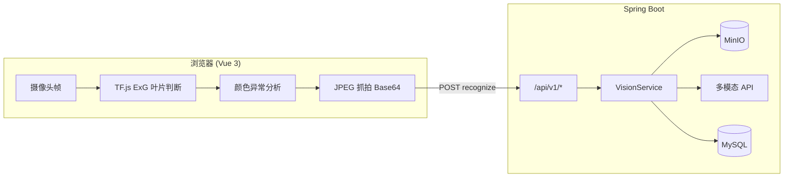

# 🌱 AI 植物病虫害智能监测识别系统

<p align="center">
  <b>🎥 浏览器端实时预处理 · 🤖 多模态大模型识图 · ☁️ 对象存储与历史追溯</b>
</p>

<p align="center">
  🎓 <i>本项目源于 <b>兰州理工大学</b> 校级大学生创新创业训练计划（大创）项目。</i> 🌾
</p>

<p align="center">
  
  
  
  
  
  
</p>

面向温室、大田与教学演示场景的 **植物病害辅助识别** 项目：前端用摄像头持续采样，在本地完成「是否有叶片 → 颜色是否异常」的轻量判断，仅在疑似异常时抓拍并调用后端；后端将图片存入 MinIO，通过 **OpenAI 兼容的多模态 Chat API** 返回结构化 JSON（作物、病虫、危害等级、合规防治建议），并写入 MySQL 供历史查询与导出。

> 📌 **说明**：识别结果来自大模型与图像启发式规则，仅供农业辅助决策与科研教学参考，不能替代植保专家田间诊断或官方检疫结论。

---

## 📑 目录

- [✨ 功能特性](#功能特性)
- [🏗️ 系统架构](#系统架构)
- [🛠️ 技术栈](#技术栈)
- [📁 项目结构](#项目结构)
- [🧠 核心业务逻辑](#核心业务逻辑)
- [📦 环境要求](#环境要求)
- [🚀 快速开始](#快速开始)
- [⚙️ 配置说明](#配置说明)
- [📡 API 文档](#api-文档)
- [🗄️ 数据库](#数据库)
- [❓ 常见问题](#常见问题)
- [⚖️ 免责声明](#免责声明)
- [🤝 贡献与许可](#贡献与许可)

---

## ✨ 功能特性

| 能力 | 说明 |
|------|------|
| **实时摄像头监测** | 基于 `getUserMedia`，支持前后置；页面隐藏时暂停检测循环 |
| **前端两级预处理** | ① TensorFlow.js + ExG 植被指数判断画面内是否存在足够「植被」区域；② 在 ROI 内做黄/褐色异常像素占比分析 |
| **防抖与锁窗** | 连续多帧满足异常才触发；抓拍后在锁定期内不重复上传，降低 API 费用与误报 |
| **多模态识图** | 后端将 JPEG 以 `data:image/jpeg;base64,...` 形式传入兼容 OpenAI 的 Chat Completions，要求 `json_object` 输出 |
| **对象存储** | 原图上传 MinIO，向前端返回预签名 URL 用于预览与历史展示 |
| **持久化与导出** | 识别记录落库；前端支持历史列表与 **Excel（xlsx）导出** |
| **限流** | `/api/v1/recognize` 按客户端 IP 滑动窗口限流，可配置每分钟次数 |
| **可配置 Prompt** | classpath 下的文本模板 + 作物上下文占位符，强调防治建议合规表述 |

---

## 🏗️ 系统架构



---

## 🛠️ 技术栈

### 前端 (`frontend/`)

- **Vue 3**（Composition API）+ **Vite 5**
- **TensorFlow.js** + **WebGL 后端**：植被指数与张量运算
- **SheetJS (xlsx)**：历史记录导出
- 原生 **Fetch** 调用 REST API

### 后端 (`backend/`)

- **Java 17**、**Spring Boot 3.3**（Web、Validation、Data JPA、JDBC）
- **MySQL 8** + **Hibernate**（`ddl-auto: update` 便于开发）
- **MinIO Java SDK**：上传与预签名 URL
- **java.net.http.HttpClient**：调用上游视觉模型（无额外 HTTP 客户端依赖）
- **Jackson**：解析模型返回的 JSON 片段

### 基础设施

- **MySQL**：识别记录
- **MinIO**：图片对象存储（S3 兼容 API）

---

## 📁 项目结构

```
ai-plant-disease-prediction/
├── backend/                          # Spring Boot 服务
│   ├── pom.xml
│   └── src/main/
│       ├── java/com/example/aiplantdisease/
│       │   ├── PlantDiseaseApplication.java
│       │   ├── api/                  # 统一响应 ApiResponse
│       │   ├── config/               # CORS、限流 RateLimitFilter
│       │   ├── controller/           # VisionController（REST）
│       │   ├── dto/                  # 请求/响应 DTO
│       │   ├── entity/               # JPA 实体 RecognitionRecord
│       │   ├── repository/
│       │   ├── service/              # VisionService、SystemConfigService
│       │   ├── storage/              # MinioStorageService
│       │   ├── ai/                   # AiVisionClient、DoubaoVisionClient
│       │   ├── prompt/               # PromptBuilder
│       │   └── exception/            # 全局异常处理
│       └── resources/
│           ├── application.yml       # 数据源、MinIO、AI、限流等
│           ├── schema.sql            # 建表参考（可选）
│           └── prompts/doubao/
│               └── plant_disease_prompt.txt
├── frontend/
│   ├── package.json
│   ├── vite.config.js
│   ├── index.html
│   └── src/
│       ├── main.js
│       ├── App.vue                   # 页面：摄像头、参数、结果、历史
│       ├── api.js                    # 后端 API 封装
│       └── detection.js              # 叶片检测、颜色分析、JPEG 抓拍
└── README.md
```

`frontend/public/models/leaf-model/` 预留了 **TensorFlow GraphModel** 目录说明；当前主流程中的「叶片检测」实现为 **ExG + 候选像素统计**（见 `detection.js`），与是否放置 `model.json` 无强绑定；若你后续替换为真正的轻量分割/检测模型，可在此目录部署权重并调整加载逻辑。

---

## 🧠 核心业务逻辑

### 前端监测流水线（约每 500ms 一帧，单帧串行防堆积）

1. 将视频帧绘制到隐藏 `canvas`。
2. **`runLeafDetectionLite`**：缩小分辨率后，在「非灰白、有足够饱和度」的像素上计算 ExG（\(2G - R - B\)）植被指数，得到植被占比；超过 `leafScoreThreshold` 认为存在叶片 ROI（当前 ROI 为全画布，便于与颜色分析衔接）。
3. **`analyzeLeafAbnormalByColor`**：在 ROI 上统计偏黄、偏褐像素比例，与阈值比较判断是否 **abnormal**。
4. **防抖**：连续 `debounceFrames` 帧均为异常才进入下一步。
5. **锁窗**：若距离上次抓拍不足 `lockoutSeconds` 秒，则重置计数并跳过，避免重复上传。
6. **`captureJpegBase64`**：缩放宽度（默认最大 1280）并 JPEG 压缩后得到 Data URL，调用 `POST /api/v1/recognize`。
7. 若返回 `isAlert` 且开启告警音，播放短促蜂鸣；并刷新历史列表。

### 后端识别流水线（`VisionService`）

1. 校验 Base64（支持 `data:image/...;base64,` 前缀）；解码后限制 **≤ 5MB**。
2. 校验图片头：**仅允许 JPEG / PNG**；PNG 转 JPEG 后统一存储。
3. 上传 MinIO，生成 `objectKey`，并生成 **预签名 URL**（给前端展示；识图使用内嵌 Base64，避免内网 URL 无法被公网模型拉取）。
4. **`PromptBuilder`**：读取模板，将 `cropType`（或占位说明）注入 `${CROP_CONTEXT}`。
5. **`DoubaoVisionClient`**：构造 OpenAI 风格多模态消息（`text` + `image_url`），`response_format: json_object`，带超时与重试。
6. **解析模型输出**：从文本中提取首个 `{...}` JSON，映射为 `isAlert`、`cropType`、`diseaseName`、`hazardLevel`、`preventionAdvice`；解析失败时兜底为非告警并提示重试。
7. **写入** `recognition_record` 表，返回 `RecognizeResponse`（含临时图片 URL）。

### 限流（`RateLimitFilter`）

- 仅拦截 `POST /api/v1/recognize`。
- 按请求 **远程 IP** 计数，默认每 60 秒窗口内不超过 `app.rateLimit.recognizePerMinute`（默认 30）；超出返回 **HTTP 429** 与 JSON 错误体。

---

## 📦 环境要求

- **JDK 17**、**Maven 3.8+**
- **Node.js 18+**（推荐 LTS）与 npm
- **MySQL 8.0+**
- **MinIO**（或使用兼容 S3 的对象存储并相应修改配置）
- 可访问的 **多模态大模型 API**（OpenAI 兼容 Chat Completions；需支持 `image_url` 与 JSON 输出模式）

---

## 🚀 快速开始

### 1. 准备数据库

```sql
CREATE DATABASE plant_disease DEFAULT CHARACTER SET utf8mb4 COLLATE utf8mb4_unicode_ci;
```

可参考 `backend/src/main/resources/schema.sql` 手动建表；开发环境下 JPA `ddl-auto: update` 也会自动维护表结构。

### 2. 启动 MinIO

使用 Docker 示例（凭证需与 `application.yml` 中 `minio.accessKey` / `secretKey` 一致）：

```bash
docker run -d --name minio -p 9000:9000 -p 9001:9001 -e MINIO_ROOT_USER=admin -e MINIO_ROOT_PASSWORD=password123 minio/minio server /data --console-address ":9001"
```

在 MinIO 控制台创建与配置一致的 **Bucket**（如 `plant-disease`）。

### 3. 配置后端

编辑 `backend/src/main/resources/application.yml`：

- `spring.datasource.*`：MySQL 地址、库名、用户名、密码
- `minio.*`：endpoint、密钥、bucket
- `ai.vision.*`：`endpoint`、`apiKey`、`model`（须为**支持视觉**的模型）

或通过环境变量覆盖（推荐生产环境），例如：

| 变量 | 含义 |
|------|------|
| `AI_VISION_ENDPOINT` | Chat Completions 兼容地址 |
| `AI_VISION_API_KEY` | Bearer Token |
| `AI_VISION_MODEL` | 模型名（如 `gpt-4o-mini`、通义千问视觉模型等） |
| `VITE_BASE_URL` | 前端同源或网关地址（后端读取用于 CORS 等，见 `app.frontendBaseUrl`） |

启动后端：

```bash
cd backend
mvn spring-boot:run
```

默认监听 **http://localhost:8080**。

### 4. 启动前端

```bash
cd frontend
npm install
npm run dev
```

开发服务器默认 **http://localhost:5173**。

将前端环境变量 `VITE_BASE_URL` 指向后端（若前后端不同源），例如在 `frontend` 目录创建 `.env.local`：

```env
VITE_BASE_URL=http://localhost:8080
```

生产构建：

```bash
npm run build
```

将 `frontend/dist` 部署到任意静态服务器，并确保浏览器能访问后端与 MinIO 预签名 URL（跨域已在 `CorsConfig` 中按 `app.frontendBaseUrl` 配置）。

### 5. 使用浏览器访问

1. 使用 **HTTPS 或 localhost** 打开页面（摄像头权限要求）。
2. 点击 **开始监测**，允许摄像头。
3. 根据场景调节阈值、防抖帧数与锁窗时间（也可先拉取 `/api/v1/config` 的推荐默认值）。
4. 异常触发后会自动识别；右侧可查看结果、历史，并 **导出 Excel**。

---

## ⚙️ 配置说明

### `application.yml` 摘要

| 配置项 | 说明 |
|--------|------|
| `server.port` | 后端端口，默认 `8080` |
| `spring.datasource.*` | MySQL 连接 |
| `spring.jpa.hibernate.ddl-auto` | 开发常用 `update`；生产建议改为 `validate` + 迁移工具 |
| `app.frontendBaseUrl` | CORS 允许的前端来源 |
| `app.rateLimit.recognizePerMinute` | 每分钟每 IP 最大识别次数 |
| `minio.*` | 对象存储连接与 bucket |
| `ai.vision.*` | 多模态 API 端点、密钥、模型、超时、重试 |
| `ai.vision.skipDeepSeekTextOnlyCheck` | 若使用代理且实际为多模态，可跳过 DeepSeek 纯文本模型校验 |
| `ai.prompt.file` | Prompt 模板 classpath 路径 |

### 模型选型注意

- **DeepSeek** 官方 `deepseek-chat` / `deepseek-reasoner` 为纯文本，**不能**直接传图；需换用支持 `image_url` 的多模态模型，或在代理层换模型后设置 `skipDeepSeekTextOnlyCheck=true`。
- 默认示例配置指向 **阿里云 DashScope 兼容模式** 等；请以你实际购买的 API 文档为准修改 `endpoint` 与 `model`。

---

## 📡 API 文档

统一响应结构：

```json
{
  "code": 0,
  "message": "success",
  "data": { },
  "timestamp": 1710000000000
}
```

`code !== 0` 表示业务或校验错误；HTTP 429 时 `code` 为 429。

### `POST /api/v1/recognize`

请求体：

```json
{
  "imageBase64": "data:image/jpeg;base64,/9j/4AAQ...",
  "cropType": "番茄"
}
```

- `imageBase64`：必填；可为 Data URL 或纯 Base64。
- `cropType`：可选；为空或占位时 Prompt 会引导模型主要从图像推断作物。

成功时 `data` 字段（`RecognizeResponse`）包含：`recordId`、`isAlert`、`cropType`、`diseaseName`、`hazardLevel`、`preventionAdvice`、`imageUrl`（预签名）。

### `GET /api/v1/config`

返回前端可用的默认检测参数（`SystemConfigResponse`）：`cropTypeDefault`、`leafScoreThreshold`、`abnormalRatioThreshold`、`debounceFrames`、`lockoutSeconds`。

### `GET /api/v1/records?limit=20`

返回最近识别记录列表（单页上限 50），每项含预签名 `imageUrl`（若签名失败则可能为空）。

---

## 🗄️ 数据库

表 **`recognition_record`** 主要字段：

| 字段 | 说明 |
|------|------|
| `id` | UUID |
| `crop_type` / `disease_name` / `hazard_level` | 模型解析结果 |
| `prevention_advice` | 防治建议（长文本） |
| `image_key` | MinIO 对象键 |
| `is_alert` | 是否告警 |
| `create_time` | UTC 时间戳 |

---

## ❓ 常见问题

**1. 摄像头无法打开**  
确认使用 `localhost` 或 HTTPS；检查浏览器权限与是否被其它应用占用。

**2. 识别返回 400 / 模型拒绝图片**  
检查 `endpoint` 是否为 **视觉** Chat API、`model` 是否支持 `image_url`；内网 MinIO URL 不可用时，本项目已采用 **Base64 内嵌**，一般无需再传外链。

**3. 后端提示 `AI apiKey is empty`**  
设置环境变量 `AI_VISION_API_KEY` 或在 `application.yml` 中填写 `ai.vision.apiKey`（勿将真实密钥提交到公开仓库）。

**4. CORS 错误**  
将 `app.frontendBaseUrl` 设为实际前端访问来源（含端口）。

**5. 429 过于频繁**  
适当调大 `app.rateLimit.recognizePerMinute`，或降低前端抓拍频率（锁窗、阈值）。

---

## ⚖️ 免责声明

本项目输出不构成医疗或法律意见；农业防治建议应结合当地法规、农药标签与植保部门指导。因误识、误报、模型漂移或网络故障导致的任何损失，作者与贡献者不承担法律责任。

---

## 🤝 贡献与许可

欢迎提交 Issue / Pull Request：建议先说明环境（OS、浏览器、JDK、模型厂商）与复现步骤。

若未另行声明仓库根目录许可证文件，默认以项目所有者指定为准；添加 `LICENSE` 前请勿假设为特定开源协议。

---

<p align="center">
  ⭐ 如果本项目对你有帮助，欢迎 <b>Star</b> 与 <b>Fork</b> —— 感谢支持！ 🙌
</p>
